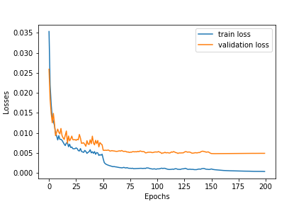

# Macuject ML Challenge Task

## Setup environment
Setup the ``ML_Challenge`` environment and use it in jupyter notebook. Use following command to setup the environment:  

```conda env create --name ML_challenge --file=environments.yml```

## Result discussion
The number of neurons and layers of the trained model is manually choosen by few experiments. I train total 200 epochs and achieve best MAE result in validation set = <strong>.004833</strong>. I use multi-step learning rate which does the tricks to reduce MAE error in such low number. The figure 1 shows the trend of training and validation losses. The figure shows that the model overfit with training data with in few epochs. Both train and validation loss almost stop decreasing after 150 epochs. Therefore we train the model maximum 200 epochs.

<div align="center"></div>
<div align="center"><strong>Figs 1. Train and validation losses in terms of MAE metric. (Epochs vs Losses)</strong></div>

